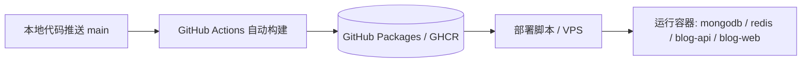

# 云服务器部署指南 (GitHub Packages / GHCR 模式)

这份文档面向线上 `wanderlust0736.top` 的生产部署与日常更新。
当前项目**纯采用 GitHub Packages (GHCR)** 进行镜像分发与容器化部署。
目标 VPS 不需要保留源码，也不承担 Node/Vite 或 Go 编译负荷；运行目录仅保留 Compose 配置、环境变量、运维脚本、证书与数据备份。

---

## 架构与工作流



1. **构建与分发**：代码推送到 `main` 分支后，GitHub Actions 自动在云端执行跨平台构建（`linux/amd64`），并将镜像推送至 GitHub Packages：
   - `ghcr.io/siyuansun0736/my_blog/blog-api:latest`
   - `ghcr.io/siyuansun0736/my_blog/blog-web:latest`
2. **部署执行**：通过 `./scripts/deploy-ghcr.sh`（或在服务器上直接执行 `docker compose pull && docker compose up -d`），服务器仅负责自动备份、拉取最新 Packages 镜像、重启服务、冒烟测试与清理。

---

## 1GB VPS 运行时优化

当前仓库已经针对低内存 VPS 做了运行时内存压制与资源优化：
- **MongoDB**：使用 `MONGODB_WIREDTIGER_CACHE_GB=0.25`，限制 WiredTiger 缓存为 256MB。
- **Redis**：配置 `REDIS_MAXMEMORY=64mb` 与 `allkeys-lru` 淘汰策略。
- **Go 后端**：配置 `GIN_MODE=release`、`BLOG_API_GOMEMLIMIT=120MiB` 与 `BLOG_API_GOGC=50`。
- **PDF 导出**：服务端局部渲染按需调用 Chromium，单次导出复用同一个会话，避免频繁启动。

---

## 前置准备

1. **DNS 解析**：
   - `wanderlust0736.top` -> 服务器公网 IP
   - `www.wanderlust0736.top` -> `wanderlust0736.top` (CNAME) 或服务器公网 IP
2. **服务器环境**：
   - 安装 Docker 与 Docker Compose（`docker compose version` $\ge 2.20$）
   - 防火墙放行 `80` 和 `443` 端口
3. **SSH 配置**（便于本机直接执行部署）：
   - 在本机 `~/.ssh/config` 中配置 `blog-server` 主机别名。

---

## 首次上线步骤

### 1. 服务器创建运行目录与环境配置
```bash
ssh blog-server
mkdir -p /opt/my_blog
cd /opt/my_blog
```

在服务器上创建 `.env.deploy`（可参考仓库中的 `.env.deploy.example`）：
```bash
BLOG_PRIMARY_DOMAIN=wanderlust0736.top
BLOG_WWW_DOMAIN=www.wanderlust0736.top
BLOG_TLS_CERTS_DIR=./letsencrypt
BLOG_CERTBOT_WEBROOT_DIR=./certbot/www
BLOG_TLS_CERT_PATH=/etc/nginx/certs/live/wanderlust0736.top/fullchain.pem
BLOG_TLS_KEY_PATH=/etc/nginx/certs/live/wanderlust0736.top/privkey.pem
BLOG_TLS_AUTO_RELOAD=1
BLOG_TLS_RELOAD_INTERVAL_SECONDS=60
BLOG_WRITE_TOKEN=你的高强度随机管理令牌
BLOG_API_IMAGE=ghcr.io/siyuansun0736/my_blog/blog-api:latest
BLOG_WEB_IMAGE=ghcr.io/siyuansun0736/my_blog/blog-web:latest
REDIS_MAXMEMORY=64mb
MONGODB_WIREDTIGER_CACHE_GB=0.25
GIN_MODE=release
BLOG_API_GOMEMLIMIT=120MiB
BLOG_API_GOGC=50
```

### 2. 首次证书申请（Let's Encrypt）
在服务器运行目录下：
```bash
# 确保 80 端口无占用
export CERTBOT_EMAIL=你的邮箱@example.com
docker compose --profile certbot run --rm --service-ports certbot certonly \
  --standalone \
  --preferred-challenges http \
  --agree-tos \
  --no-eff-email \
  --email "$CERTBOT_EMAIL" \
  -d wanderlust0736.top \
  -d www.wanderlust0736.top
```

### 3. 拉取 Packages 镜像并启动
```bash
docker compose --env-file .env.deploy pull
docker compose --env-file .env.deploy up -d --no-build
```

---

## 日常一键部署与更新 (推荐)

每次修改代码推送到 `main` 分支后，GitHub Actions 会自动构建并发布 Packages 镜像。

你只需在本地仓库执行：
```bash
./scripts/deploy-ghcr.sh
```

如需查看部署后的最新日志：
```bash
./scripts/deploy-ghcr.sh --logs
```

### 该脚本自动完成以下全套流程：
1. **连通性与配置检查**：检查远端 VPS Docker 与 `.env.deploy` 文件。
2. **自动备份**：自动调用 `scripts/backup-mongodb.sh` 备份数据库与媒体文件。
3. **拉取 Packages 镜像**：直接拉取 GHCR 镜像。
4. **平滑重启**：使用 `--no-build --force-recreate` 重建应用容器，保留所有持久化数据卷（`mongodb-data`、`redis-data`、`blog-media`）。
5. **冒烟测试验证**：自动发起本地回环 API 健康探测。
6. **清理临时文件**：保持服务器工作目录整洁。

---

## 运维与管理常用命令

### 查看服务状态与日志
```bash
cd /opt/my_blog
docker compose --env-file .env.deploy ps
docker compose --env-file .env.deploy logs -f blog-api
docker compose --env-file .env.deploy logs -f blog-web
```

### 数据库手动备份与恢复
- **备份**：
  ```bash
  cd /opt/my_blog
  ./scripts/backup-mongodb.sh
  ```
  备份归档将保存在 `./backups/mongodb/<timestamp>/`。
- **恢复**：
  ```bash
  cd /opt/my_blog
  ./scripts/restore-mongodb.sh ./backups/mongodb/备份目录
  ```

### 安装证书自动续期定时任务 (Systemd Timer)
```bash
cd /opt/my_blog
./scripts/install-cert-renew-timer.sh
sudo systemctl status wanderlust-cert-renew.timer
```

---

## 故障排查（FAQ）

1. **访问 503 Write Access Not Configured**：
   - 检查 `.env.deploy` 中是否设置了 `BLOG_WRITE_TOKEN`。修改后执行 `docker compose --env-file .env.deploy up -d --force-recreate blog-api`。
2. **证书过期或重载未生效**：
   - 执行手动续期测试：`CERTBOT_DRY_RUN=1 ./scripts/renew-letsencrypt.sh`。
   - `blog-web` 会自动检测 `./letsencrypt` 目录变动并在 60 秒内热重载 Nginx，无需重启容器。
3. **Packages 镜像拉取权限**：
   - 如果 Packages 设为私有，可在服务器上先执行 `echo $CR_PAT | docker login ghcr.io -u USERNAME --password-stdin`。
