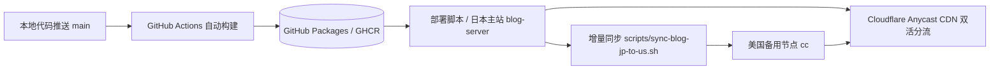

# 云服务器部署与跨洋双活运维指南 (GHCR + Cloudflare Anycast 模式)

这份文档面向线上 `wanderlust0736.top` 的生产部署、跨洋双活热备同步与日常运维。
当前项目**采用 GitHub Packages (GHCR)** 进行镜像分发与容器化部署，并通过 **Cloudflare Anycast CDN** 接入日本东京主站与美国洛杉矶热备节点，享有 15 年免维护 Origin CA 证书与动态读写分离。

---

## 架构与工作流


```mermaid
flowchart LR
    Dev[本地代码推送 main] --> Actions[GitHub Actions 自动构建]
    Actions --> GHCR[(GitHub Packages / GHCR)]
    GHCR --> DeployJP[部署脚本 / 日本主站 blog-server]
    DeployJP --> SyncUS[增量同步 scripts/sync-blog-jp-to-us.sh]
    SyncUS --> DeployUS[美国备用节点 cc]
    DeployJP & DeployUS --> CF[Cloudflare Anycast CDN 双活分流]
```

1. **构建与分发**：代码推送到 `main` 分支后，GitHub Actions 自动在云端执行跨平台构建（`linux/amd64`），并将镜像推送至 GitHub Packages：
   - `ghcr.io/siyuansun0736/my_blog/blog-api:latest`
   - `ghcr.io/siyuansun0736/my_blog/blog-web:latest`
2. **生产部署**：通过 `./scripts/deploy-ghcr.sh`，服务器自动备份现有数据、拉取最新 GHCR 镜像、平滑重启服务并完成 API 冒烟测试。
3. **跨洋热备同步**：通过 `scripts/sync-blog-jp-to-us.sh`（Crontab 每日定时或手动触发），自动比对 SHA-256 指纹并将增量数据同步至美国节点。

---

## 1GB VPS 运行时资源压制

当前仓库针对 1GB 低内存 VPS 做了运行时内存深度优化：
- **MongoDB**：使用 `MONGODB_WIREDTIGER_CACHE_GB=0.25`，限制 WiredTiger 缓存为 256MB。
- **Redis**：配置 `REDIS_MAXMEMORY=64mb` 与 `allkeys-lru` 淘汰策略。
- **Go 后端**：配置 `GIN_MODE=release`、`BLOG_API_GOMEMLIMIT=120MiB` 与 `BLOG_API_GOGC=50`。
- **PDF 导出**：服务端局部渲染按需调用 Chromium，单次导出复用同一个会话，避免频繁启动。

---

## 前置准备与网络拓扑

1. **DNS 解析 (Cloudflare 控制台)**：
   - `@` (A) -> `216.23.120.223` (日本源站，Proxy 开启 🟠)
   - `@` (AAAA) -> `2a0e:97c0:3f4:1::8c` (日本源站，Proxy 开启 🟠)
   - `@` (A) -> `113.20.0.79` (美国源站，Proxy 开启 🟠)
   - `@` (AAAA) -> `2607:f130:0:148::ce06:22fc` (美国源站，Proxy 开启 🟠)
   - `vps2` (A/AAAA) -> 日本节点 (DNS-only 灰云 ☁️，专用于 Xray 代理与直连面板)
   - `cc` (A/AAAA) -> 美国节点 (DNS-only 灰云 ☁️，专用于 Xray 代理)
2. **服务器环境**：
   - 安装 Docker 与 Docker Compose（`docker compose version` $\ge 2.20$）
   - 防火墙放行 `80` 和 `443` 端口（宿主机 443 由 `sni-router` 预读分流）
3. **SSH 免密配置**：
   - 在本机 `~/.ssh/config` 中配置 `blog-server` 与 `cc` 别名。

---

## 证书管理 (Cloudflare 15 年 Origin CA 证书)

集群已全面淘汰 Let's Encrypt 90 天繁琐续期，改用 Cloudflare 官方颁发的 Origin CA 证书：
- **有效期**：至 **2041 年 9 月 25 日**（15 年超长免维护）；
- **证书位置**：
  - 证书公钥：`./letsencrypt/live/wanderlust0736.top/fullchain.pem`
  - 证书私钥：`./letsencrypt/live/wanderlust0736.top/privkey.pem`
- **CDN 模式**：Cloudflare SSL/TLS 设置为 **`Full (strict)`** 强加密模式。

---

## 日常一键部署与更新 (推荐)

每次修改代码推送到 `main` 分支后，GitHub Actions 会自动构建并发布 Packages 镜像。

你只需在本地仓库执行：
```bash
./scripts/deploy-ghcr.sh
```

如需查看部署后的最新日志：
```bash
./scripts/deploy-ghcr.sh --logs
```

### 该脚本自动完成以下全套流程：
1. **连通性与配置检查**：检查远端 VPS Docker 与 `.env.deploy` 文件。
2. **自动备份**：自动调用 `scripts/backup-mongodb.sh` 备份数据库与媒体文件。
3. **拉取 Packages 镜像**：直接拉取 GHCR 镜像。
4. **平滑重启**：使用 `--no-build --force-recreate` 重建应用容器，保留所有持久化数据卷（`mongodb-data`、`redis-data`、`blog-media`）。
5. **冒烟测试验证**：自动发起本地回环 API 健康探测。
6. **清理临时文件**：保持服务器工作目录整洁。

---

## 跨洋双活同步与美国节点管理

### 1. 手动触发数据增量同步
在日本主节点执行：
```bash
/opt/my_blog/scripts/sync-blog-jp-to-us.sh
```
- 若文章数据与媒体无变动，脚本比对 SHA-256 指纹后会在 1 秒内安全退出，避免无谓跨洋传输。
- 若有变动，自动通过 SSH 管道流式同步 MongoDB 并增量同步媒体卷。

### 2. 自动化守护 (Crontab)
日本节点已配置定时任务（每日早 07:00 与晚 19:00）：
```cron
0 7,19 * * * /opt/my_blog/scripts/sync-blog-jp-to-us.sh >> /var/log/blog-sync.log 2>&1
```

---

## 运维与管理常用命令

### 查看服务状态与日志
```bash
cd /opt/my_blog
docker compose --env-file .env.deploy ps
docker compose --env-file .env.deploy logs -f blog-api
docker compose --env-file .env.deploy logs -f blog-web
```

### 数据库手动备份与恢复
- **备份**：
  ```bash
  cd /opt/my_blog
  ./scripts/backup-mongodb.sh
  ```
  备份归档将保存在 `./backups/mongodb/<timestamp>/`。
- **恢复**：
  ```bash
  cd /opt/my_blog
  ./scripts/restore-mongodb.sh ./backups/mongodb/备份目录
  ```

---

## 故障排查（FAQ）

1. **访问 503 Write Access Not Configured**：
   - 检查 `.env.deploy` 中是否设置了 `BLOG_WRITE_TOKEN`。修改后执行 `docker compose --env-file .env.deploy up -d --force-recreate blog-api`。
2. **美国节点写操作行为**：
   - 美国节点的 Nginx 默认配置了动态写转发，POST/PUT/DELETE 请求会自动透明代理回日本主节点处理。
3. **Packages 镜像拉取权限**：
   - 如果 Packages 设为私有，可在服务器上先执行 `echo $CR_PAT | docker login ghcr.io -u USERNAME --password-stdin`。
