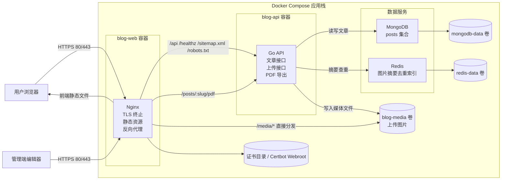

# 总架构图

这份文档把 MongoDB、Redis、Nginx、Docker 四部分放到同一张图里，描述当前博客系统的整体运行关系。

## 总览

## 四部分如何串起来

### 1. Docker 负责把所有角色编排成一套栈

Docker Compose 是总装层，负责拉起 `mongodb`、`redis`、`blog-api`、`blog-web` 和可选的 `certbot`。它同时定义：

- 服务之间的依赖关系
- 网络互通方式
- 命名卷挂载方式
- 环境变量和资源限制

没有 Docker，这四部分仍然可以单独存在；有了 Docker，它们才形成一套稳定可重复的运行环境。

### 2. Nginx 是所有外部请求的统一入口

浏览器访问站点时，请求首先进入 `blog-web` 容器中的 Nginx。Nginx 负责：

- 终止 HTTPS
- 把 HTTP 跳转到 HTTPS
- 统一主域名和 `www` 域名
- 直接服务前端静态页面
- 把 API 请求转发给 `blog-api`
- 直接对外暴露共享媒体卷里的 `/media/*`

也就是说，MongoDB 和 Redis 都不会直接被公网访问，它们只在 Compose 内网里对后端开放。

### 3. Go 后端承接业务逻辑并连接 MongoDB 与 Redis

`blog-api` 是业务核心层，承担：

- 文章增删改查
- 草稿与精选规则控制
- 图片上传与路径生成
- PDF 导出
- 动态 `sitemap.xml` 与 `robots.txt`

在这层里：

- MongoDB 保存文章主数据
- Redis 保存图片摘要到路径的映射
- 媒体文件直接落到共享卷 `blog-media`

所以主数据和辅助索引被刻意拆开了：MongoDB 是事实来源，Redis 是性能优化索引。

### 4. MongoDB 与 Redis 的职责边界不同

MongoDB 保存“文章是什么”，Redis 保存“这张图以前传过没有”。

具体来说：

- MongoDB 是主库，负责文章正文、标题、标签、草稿状态等长期业务数据
- Redis 不是主库，只为上传去重服务
- 即使 Redis 挂掉，系统仍能工作；只是重复图片会再次落盘
- 如果 MongoDB 丢失，文章主内容就无法恢复

这就是两者在重要性和故障影响上的核心差别。

### 5. 共享卷把“数据”和“容器”解耦

当前架构使用三类关键命名卷：

- `mongodb-data`：保存 MongoDB 数据文件
- `redis-data`：保存 Redis 持久化数据
- `blog-media`：保存上传图片

这意味着日常重建 `blog-api` 或 `blog-web` 镜像时，业务数据不会跟着一起消失。

## 一次完整请求如何流动

### 公开文章访问

1. 用户访问站点域名，请求先到 Nginx。
2. 如果是前端页面，Nginx 直接返回静态资源。
3. 前端再调用 `/api/posts` 或 `/api/posts/:slug`。
4. Nginx 将请求转发到 `blog-api`。
5. `blog-api` 从 MongoDB 读取文章并返回 JSON。

### 管理端上传图片

1. 管理端向 `/api/admin/uploads/images` 发送上传请求。
2. Nginx 把请求代理到 `blog-api`。
3. `blog-api` 计算图片 SHA-256。
4. `blog-api` 查询 Redis，看该摘要是否已有路径映射。
5. 若命中且文件仍存在，则直接返回已有 `/media/...` 路径。
6. 若未命中，则写入 `blog-media` 卷，并把映射保存到 Redis。
7. 后续浏览器访问该图片时，由 Nginx 直接从共享卷对外分发。

## 当前架构的特点

这套架构的核心特点可以概括为三点：

- 入口统一：外部只需要访问 Nginx
- 状态分层：MongoDB 管主数据，Redis 管辅助索引，媒体走独立卷
- 运维务实：用 Docker Compose 维持单机可部署性，而不是提前上复杂编排

对当前这个单站点博客来说，这个结构足够清晰，也足够稳。