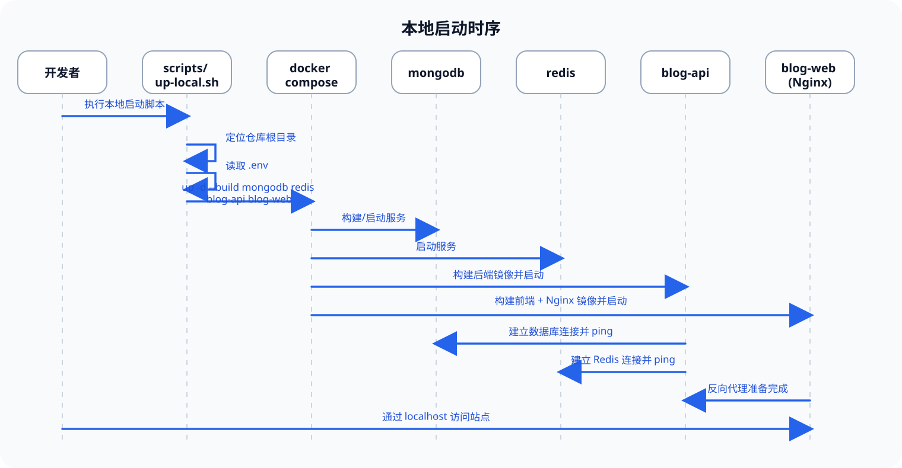

# 部署时序

这份文档说明当前仓库里两条主要运行路径：

- 本地启动流程
- 线上更新流程

重点不是抽象原则，而是按当前脚本和 Compose 设计把完整执行顺序写清楚。

## 本地启动时序

本地开发默认通过 `scripts/up-local.sh` 启动整套栈。该脚本会读取根目录 `.env`，然后执行带 `--build` 的 Compose 启动。

### 时序图

### 详细步骤

1. 开发者执行 `./scripts/up-local.sh`。
2. 脚本定位仓库根目录，并确认本地环境文件存在。
3. 脚本读取 `.env` 作为 Compose 环境。
4. 脚本执行 `docker compose --env-file "$compose_env_file" up -d --build mongodb redis blog-api blog-web`。
5. Compose 启动 `mongodb` 与 `redis`，并构建 `blog-api`、`blog-web` 镜像。
6. `blog-api` 启动后连接 MongoDB，并在可用时连接 Redis。
7. `blog-api` 在启动阶段还会完成 MongoDB 连通性检查和 `slug` 唯一索引检查。
8. `blog-web` 启动后加载 Nginx 配置、证书路径和前端构建产物。
10. 开发者通过本地域名或 `https://localhost:8444` 访问站点；宿主机 `443` 预留给前置 SNI router。

### 本地启动的特点

- 默认使用 `.env`
- 保留 Compose 默认并发，适合本机资源更宽松的场景
- 同时启动 MongoDB、Redis、API、Nginx 四个主要服务
- 如果只想看完整站点行为，优先走这条链路，而不是只开前端预览

## 线上更新时序

线上环境默认从本机执行 `scripts/update-low-memory.sh`。脚本在本机完成镜像构建，上传到 VPS 后只执行 `docker load` 和 `docker compose up --no-build`，目标机不承担 Node/Vite 或 Go 构建。

### 详细步骤

1. 运维在本机执行 `./scripts/update-low-memory.sh`。
2. 脚本确认本机 `git`、`docker`、`docker buildx`、`scp`、`ssh`、`curl` 和 Compose 能正常使用。
3. 脚本识别本机 shell 环境：macOS、Linux 或 Windows。
4. 如果没有显式跳过，脚本会先检查本机 tracked 文件是否干净，并确认本机分支已经推到 upstream。
5. 脚本在本机按目标平台构建 `blog-api` 和 `blog-web` 镜像，默认目标平台是 `linux/amd64`。
6. 脚本把两个镜像保存为压缩归档，并上传到目标机 `/tmp`。
7. 如果没有显式跳过备份，脚本会在目标机调用 `scripts/backup-mongodb.sh`：

   - 从 `mongodb` 导出数据库归档
   - 从 `blog-api` 打包媒体目录
   - 把结果写到 `backups/mongodb/`，并同步到 `backups/latest-mongodb/`

8. 如果没有显式跳过拉取，脚本会在目标机执行非交互式 `git pull --ff-only`。
9. 脚本在目标机执行 `docker load` 导入本机传来的镜像。
10. 脚本执行 `docker compose --env-file .env.deploy up -d --no-build mongodb redis blog-api blog-web`。
11. Compose 先拉起 MongoDB 和 Redis，并等待健康检查通过。
12. `blog-api` 在依赖健康后启动，连接 MongoDB 和 Redis。
13. `blog-web` 启动，接管 `80` 和宿主机 `127.0.0.1:8444`，并加载证书和前端静态资源；宿主机 `443` 留给前置 SNI router。
14. 脚本执行 `docker compose ps` 检查容器状态。
15. 脚本通过 `curl -k --resolve 主域名:8444:127.0.0.1 https://主域名:8444/api/posts` 验证 API 可用。
16. 如果指定了 `--logs`，脚本最后还会带出最近日志。

### 为什么线上流程要比本地更长

线上流程额外多了五类动作：

- 本机按目标平台构建镜像
- 上传并在目标机导入镜像
- 备份
- 非交互拉取代码
- 启动后健康验证

这是当前仓库针对低内存 VPS 的现实约束做出的运维设计，而不是单纯为了“流程完整”。

## 本地启动与线上更新的差异

| 维度 | 本地启动 | 线上更新 |
| --- | --- | --- |
| 环境文件 | `.env` | `.env.deploy` |
| 目标 | 开发验证 | 稳定发布 |
| 是否默认备份 | 否 | 是 |
| 是否在目标机构建 | 否 | 否 |
| 构建方式 | Compose 默认并发 | 本机构建后上传镜像 |
| 是否要求工作区干净 | 否 | 是 |
| 是否自动做 API 验证 | 通常不做 | 会做 |

## 推荐理解方式

如果只想记住一句话，可以这样理解当前部署设计：

- 本地启动追求的是方便和完整联调
- 线上更新追求的是低内存条件下的可控性和可回滚性，目标机只负责运行和加载镜像

这也是当前仓库为什么保留 `up-local.sh` 和 `update-low-memory.sh` 两条路径的原因。
