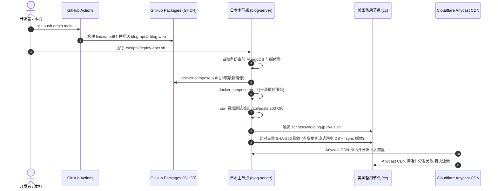

# 部署时序与跨洋双活运维流程

这份文档说明当前仓库的核心运行路径：
- 本地启动流程（本地完整联调）
- 线上主站部署与多节点热备同步流程

---

## 一、本地启动时序

本地开发默认通过 `scripts/up-local.sh` 启动整套栈。

### 详细步骤
1. 开发者执行 `./scripts/up-local.sh`；
2. 脚本定位仓库根目录并确认 `.env` 配置文件存在；
3. 执行 `docker compose --env-file .env up -d --build mongodb redis blog-api blog-web`；
4. Compose 启动 `mongodb` 与 `redis`，并构建 `blog-api`、`blog-web` 本地开发镜像；
5. `blog-api` 启动后完成 MongoDB 连通性测试与 `slug` 唯一索引检查；
6. `blog-web` 启动并加载前端产物，开发者通过 `https://localhost:8444` 访问完整站点（宿主机 443 预留给 SNI router）。

---

## 二、线上主站更新与双活同步时序

```mermaid
sequenceDiagram
    autonumber
    actor Dev as 开发者 / 本机
    participant GHA as GitHub Actions
    participant GHCR as GitHub Packages (GHCR)
    participant JP as 日本主节点 (blog-server)
    participant US as 美国备用节点 (cc)
    participant CF as Cloudflare Anycast CDN

    Dev->>GHA: git push origin main
    GHA->>GHCR: 构建 linux/amd64 并推送 blog-api & blog-web
    Dev->>JP: 执行 ./scripts/deploy-ghcr.sh
    JP->>JP: 自动备份当前 MongoDB 与媒体卷
    JP->>GHCR: docker compose pull (拉取最新镜像)
    JP->>JP: docker compose up -d (平滑重启服务)
    JP->>JP: curl 冒烟测试验证 /api/posts 200 OK
    JP->>US: 触发 scripts/sync-blog-jp-to-us.sh
    JP->>US: 比对文章 SHA-256 指纹 (有变更则流式同步 DB + rsync 媒体)
    CF->>JP: Anycast CDN 探活并分发亚太流量
    CF->>US: Anycast CDN 探活并分发美欧/容灾流量
```

### 线上部署执行细节

1. **云端镜像构建**：
   - 代码合并到 `main` 分支后，GitHub Actions 自动构建跨平台镜像并推送到 GHCR：
     - `ghcr.io/siyuansun0736/my_blog/blog-api:latest`
     - `ghcr.io/siyuansun0736/my_blog/blog-web:latest`
2. **日本主站部署**：
   - 执行 `./scripts/deploy-ghcr.sh`（或通过 SSH 登录 `blog-server` 后执行）；
   - 脚本先自动调用 `scripts/backup-mongodb.sh` 将当前数据与媒体文件归档备份至 `backups/`；
   - 从 GHCR 拉取最新镜像并执行平滑重建；
   - 执行 `curl -k --resolve wanderlust0736.top:8444:127.0.0.1 https://wanderlust0736.top:8444/api/posts` 进行就地健康探活。
3. **美国节点同步与写转发**：
   - 日本节点部署完成后，执行 `scripts/sync-blog-jp-to-us.sh` 将数据库与上传媒体增量同步到 `cc` 节点；
   - 美国节点的 Nginx 默认配置了动态读写分离规则：读取走本地，写入（发文章/修改）自动转发回日本主节点；
   - 系统 Crontab（`0 7,19 * * *`）每日守护，确保即使未手动触发，跨洋双节点数据依然准实时一致。
4. **Cloudflare 全球边缘分发**：
   - 两端均部署了 15 年 Origin CA 证书；
   - Cloudflare CDN 边缘节点自动感知两台源站健康度，实现跨洋负载均衡与秒级容灾切换。
